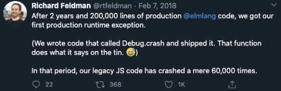
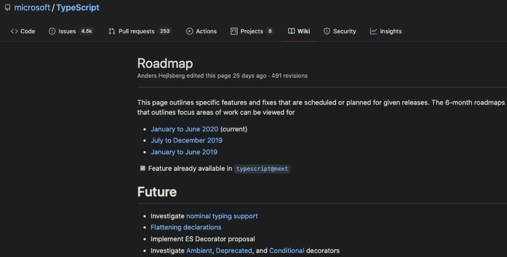
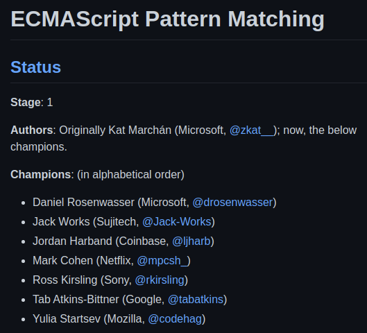
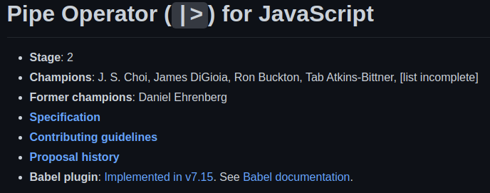
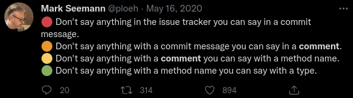

<style>
  section {
    font-size: 1.7em;
    text-align: center;
  }
  ul, pre {
    text-align: left;
  }
  .columns {
    display: grid;
    grid-auto-flow: column;
    grid-gap: 0.5em;
    align-items: center;
  }
  .columns.end {
    align-items: end;
  }
</style>

# Advanced TypeScript

## Make TS Compiler your new BFF with <br> these Functional Programming techniques

<style scoped>h1 { margin-top: 3em; margin-bottom: 1em }</style>

---

## What's Functional Programming?

```ts
const numbers = [1, 2, 3, 4, 5]
let result = 0
for (let i = 0; i < numbers.length; i++) {
  if (numbers[i] % 2 === 0) result += numbers[i] * 10
}
```

👇

```ts
const numbers = [1, 2, 3, 4, 5]

const isEven = (x: number) => x % 2 === 0
const multiplyBy = (x: number) => (y: number) => x * y
const sum = (a: number, b: number) => a + b

const result = numbers //
  .filter(isEven)
  .map(multiplyBy(10))
  .reduce(sum, 0)
```

---

## Why did I bother?

<div class="columns">


<div>



```ts
const result = fetchUsers() //
  .then((users) =>
    users.map((u) =>
      u.posts //
        .flatMap((p) => p.keywords)
        .reduce(getMostCommonElementInArray),
    ),
  ).catch((e) => throw new Error("Could not fetch users"))
```

</div>

</div>

---


---

## Literals

```ts
const changeHtmlInputType = (type: string) =>
  ...
```

<div data-marpit-fragment>

👇

```ts
const changeHtmlInputType = (type: "text" | "number" | "email") =>
  ...

changeHtmlInputType("number") // works
changeHtmlInputType("textarea") // errors
```

```ts
type RightAnswer = true

type WeekDay = 1 | 2 | 3 | 4 | 5 | 6 | 7
```

</div>

---

## Deriving literals

```ts
export const COUNTRIES = [
  {
    name: "United Kingdom",
    code: "UK",
    phone: "+442012345678",
  },
  {
    name: "Portugal",
    code: "PT",
    phone: "+351211234567",
  },
] as const

type Countries = typeof COUNTRIES
type Country = Countries[number]
type CountryCode = Country["code"] // "UK" | "PT"
```

---

## Nominal Typing

<div class="columns">

```ts
const sendEmail = (to: string, message: string) =>
  ....

sendEmail(message, user.email) // compiles
```

<div data-marpit-fragment>

👉

</div>

<div data-marpit-fragment>

```ts
type Email = string
type NonEmptyString = string

const sendEmail = (to: Email, message: NonEmptyString) =>
  ....

sendEmail(message, user.email) // compiles
```

</div>

</div>

<div data-marpit-fragment>

```ts
type Person = { name: string }
type Server = { name: string }

const rebootServer = (server: Server) =>
  ....

const person: Person = { name: "John Elliott" }
rebootServer(person) // compiles 😱
```

</div>

---

👇

```ts
type Email = unique string
type NonEmptyString = unique string

const sendEmail = (to: Email, message: NonEmptyString) =>
  ....

sendEmail(message, user.email) // COMPILER WILL SCREAM AT YOU
sendEmail(user.email, message) // compiler is happy now :)
```

---



---

👇

```ts
// reusable util
type Branded<T, B> = T & { _BRAND_: B }
```

```ts
type Email = Branded<string, "Email">
type NonEmptyString = Branded<string, "NonEmptyString">

const sendEmail = (to: Email, message: NonEmptyString) =>
  ....

sendEmail(message, user.email) // COMPILER WILL SCREAM AT YOU
sendEmail(user.email, message) // compiler is happy now :)
```

---

# Type Guards

```ts
type Email = Branded<string, "Email">

const isEmail = (input: string): input is Email => EMAIL_REGEX.test(email)
```

```ts
const email = "hello@itsme.com"

sendEmail(email) // error
if (isEmail(email)) sendEmail(email) // works
```

---

## Discriminated Unions

```ts
type PaymentMethod = {
  type: "credit_card" | "cash"
  longNumber?: string
  expiryDate?: Date
  cashAmount?: number
}
```

```ts
const ensureValidCreditCard = (method: PaymentMethod) => {
  if (method.type !== "credit_card")
    throw new Error("Cannot call ensureValidCreditCard for a non credit_card payment method")
  if (isDateExpired(method.expiryDate!)) // ! operator is code smell 👃
    ...
  ...
}
```

---

👇

```ts
type CreditCard = {
  type: "credit_card"
  longNumber: string
  expiryDate: Date
}
type Cash = {
  type: "cash"
  amount: number
}
type PaymentMethod = CreditCard | Cash
```

```ts
const ensureValidCreditCard = (method: CreditCard) => {
  if (isDateExpired(method.expiryDate))
    ...
  ...
}
```

---

# Handling Each Case

```ts
const isPaymentMethodValid = (method: PaymentMethod) => {
  if (method.type === "credit_card") return ensureValidCreditCard(method)
  return ensureCashIsEnough(method)
}
```

<div data-marpit-fragment>

👇

```ts
const isPaymentMethodValid = (method: PaymentMethod) => {
  switch (method.type) {
    case "credit_card":
      return ensureValidCreditCard(method)
    case "cash":
      return ensureCashIsEnough(method)
  }
  throw new Error(`Unhandled payment method ${method.type}`)
}
```

</div>

---

👇

```ts
// reusable util
const assertUnreachable = (value: never): never => {
  throw new Error(`This code path should never be reached at runtime: ${value}`)
}
```

```ts
const isPaymentMethodValid = (method: PaymentMethod) => {
  switch (method.type) {
    case "credit_card":
      return ensureValidCreditCard(method)
    case "cash":
      return ensureCashIsEnough(method)
  }
  return assertUnreachable(method.type)
}
```

---

# Pattern Matching

## 

---

👇

```shell
npm install ts-pattern
```

```ts
const isPaymentMethodValid = (method: PaymentMethod) =>
  match(method)
    .with({ type: "credit_card" }, ensureValidCreditCard)
    .with({ type: "cash" }, ensureCashIsEnough)
    .exhaustive()
```

---

<div class="columns">



```ts
const isPaymentMethodValid = (method: PaymentMethod) =>
  match (method) {
    when ({ type: "credit_card" }) ensureValidCreditCard(method)
    when ({ type: "cash" }) ensureCashIsEnough(method)
  }
```

</div>

---

## Any

```ts
const isEmail = (input: string): input is Email => EMAIL_REGEX.test(email)

const getUserInput = (input: any) => {
  if (!isEmail(input.email)) ...
}
```

<div data-marpit-fragment>

👇

```ts
const isEmail = (input: string): input is Email => EMAIL_REGEX.test(email)

const getUserInput = (input: unknown) => {
  if (!isEmail(input.email)) ... // error
  if (!isEmail(input && (input as { email: string }).email as string)) ... // works but meh
}
```

</div>

---

## Runtime Types

👇

```shell
npm install zod
```

```ts
const userInputSchema = z.object({
  email: z.string(),
})

const isEmail = (input: string): input is Email => EMAIL_REGEX.test(email)

const getUserInput = (input: unknown) => {
  const { email } = userInputSchema.parse(input)
  if (!isEmail(email)) ... // works
}
```

---

👇

```ts
const emailSchema = z.string().email()
const userInputSchema = z.object({
  email: emailSchema,
})

const getUserInput = (input: unknown) => {
  const { email } = userInputSchema.parse(input)
  ...
}
```

---

👇

```ts
// reusable util
const brand =
  <T>() =>
  <U>(input: U) =>
    input as Branded<U, T>
```

```ts
const emailSchema = z.string().email().transform(brand<"Email">())
type Email = z.infer<typeof emailSchema>

const userInputSchema = z.object({
  email: emailSchema,
})
type UserInput = z.infer<typeof userInputSchema>

const getUserInput = (input: unknown) => {
  const { email } = userInputSchema.parse(input)
  ...
}
```

---

## Piping

```ts
const stringToLowerCase = (input: string) => input.toLowerCase()
const replaceSpacesWithHyphens = (input: string) => input.replace(/\s/g, "-")
const trimToMaximumLength = (input: string) => input.substr(0, 50)
```

```ts
const makeSlug = (input: string) =>
  trimToMaximumLength(replaceSpacesWithHyphens(stringToLowerCase(input)))
```

<div data-marpit-fragment>

👇


```ts
const makeSlug = (input: string) =>
  input
    |> (i) => i.toLowerCase()
    |> replaceSpacesWithHyphens
    |> trimToMaximumLength
```

</div>

---



<div data-marpit-fragment>

```ts
const makeSlug = (input: string) =>
  _.flow(
    (i: string) => i.toLowerCase(),
    replaceSpacesWithHyphens,
    trimToMaximumLength,
  )(input)
```

</div>

---

# 🏋️ Real-World Exercises

<div class="columns">

<div>

```ts
type Vendor = {
  name: string
  email: string
  users: User[] // must have at least one
  isVatRegistered: boolean
  vatNumber?: string
}
```

</div>

<div data-marpit-fragment>

👉

</div>

<div data-marpit-fragment>

```ts
type Vendor = {
  name: NonEmptyString50
  email: Email
  users: NonEmptyArray<User>
  vat:
    | { type: "registered"; number: VatNumber } //
    | { type: "not_registered" }
}
```

</div>

</div>

<div data-marpit-fragment>



</div>

---

```ts
const approveMenu = (vendor: Vendor, approver: User) => {
  if (!vendor.isApproved) throw new Error("...")
  if (!approver.isAdmin) throw new Error("...")
  ...
}
```

<div data-marpit-fragment>

👇

```ts
const approveMenu = (vendor: ApprovedVendor, approver: AdminUser) => {
  ...
}
```

</div>

---

## Caveats

- DB/ORM support
- GraphQL (codegen) support
- Performance

<!-- ---

- Option
- Result
- Pure functions
  - Minimising impurity
  - communication with outside world
  - memorising
- Exercises -->

---

<!-- TODO: add URLs -->

## Resources

<div class="columns">

<div>


</div>

<div>

## Videos 🎥

- Generic: Domain Modeling Made Functional by Scott Wlaschin
- F#: Ben Gobeil's YouTube Channel

### Libraries 👨‍💻

- TypeScript: fp-ts
- TypeScript: Purify

### Books 📚

- JavaScript: Mostly adequate guide to FP
- Haskell: Learn You a Haskell for Great Good
- F#: F# for fun and profit

</div>

</div>

<style scoped>section { font-size: 1.4em }</style>

---

<div class="columns end">


## and don't ask questions<br>I can't answer

</div>
